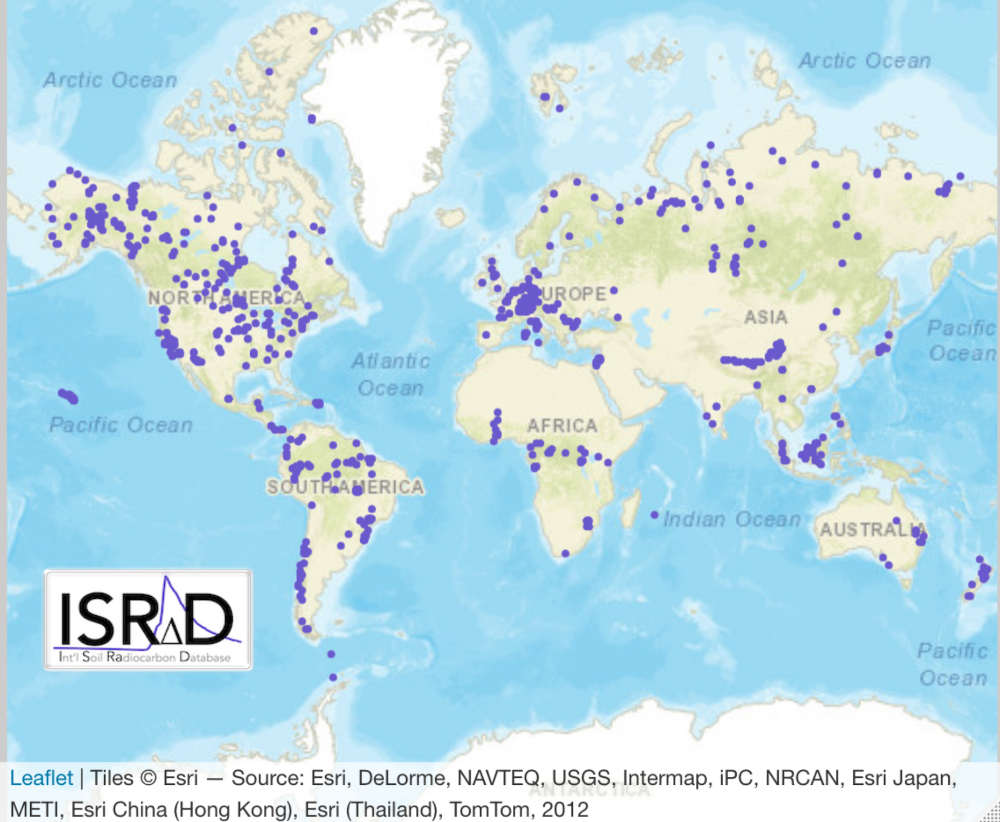
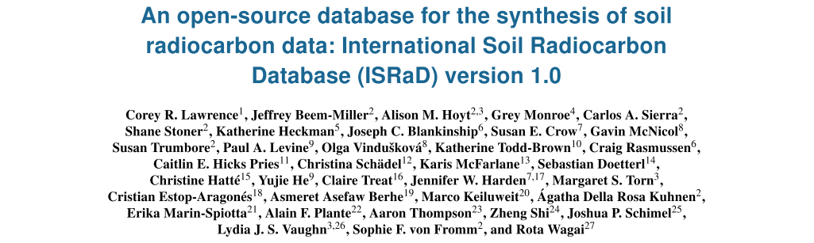

<!DOCTYPE html>
<html>
<head>
  <meta property="og:image" content="https://github.com/International-Soil-Radiocarbon-Database/ISRaD/blob/50e6434dffd7d0c3905238c66204633317e52046/assets/images/ISRaD_logos/ISRaD_logo_textbelow_white.png" />
</head>
</html>
  

<html xmlns="http://www.w3.org/1999/xhtml"
      xmlns:fb="http://ogp.me/ns/fb#">

<h1 style="font-size:40px; text-align:center;">Welcome to ISRaD</h1>

## Introducing ISRaD Version 1.0!
A new manuscript detailing the construction and utilization of ISRaD was just published in <a href="https://www.earth-system-science-data.net/">Earth System Science Data</a>. Hear we describe database fundamentals, and the application of radiocarbon data for describing the earth system. You can find the manuscript <a href="https://earth-syst-sci-data.net/12/61/2020/">here</a>.

[ISRaD news & technical updates](https://international-soil-radiocarbon-database.github.io/ISRaD/news/)

## What is ISRaD?
ISRaD is a open community repository for soil radiocarbon data.
Our goals are:
* To improve the use of radiocarbon as a constraint for understanding the soil carbon cycle
* To provide a place for researchers to contribute their soil radiocarbon data once their paper is published
* To produce tools to make the repository useful

ISRaD has been developed as a collaboration between the U.S. Geological Survey Powell Center and the Max Planck Institute for Biogeochemistry.
### 
See what people are <a href="https://essd.copernicus.org/articles/12/61/2020/essd-12-61-2020-metrics.html" target="_blank" rel="noopener noreferrer" >already doing</a> with ISRaD data!

  |
  
 

  <a class="twitter-timeline" data-height="900" href="https://twitter.com/soilradiocarbon?ref_src=twsrc%5Etfw">Tweets by  soilradiocarbon</a> 

## Contact

Please direct comments, concerns and suggestions to <a href="mailto:info.israd@gmail.com">info.israd@gmail.com</a>.

<link rel="image_src" href="https://github.com/International-Soil-Radiocarbon-Database/ISRaD/blob/50e6434dffd7d0c3905238c66204633317e52046/assets/images/ISRaD_logos/ISRaD_logo_textbelow_white.png"/>
